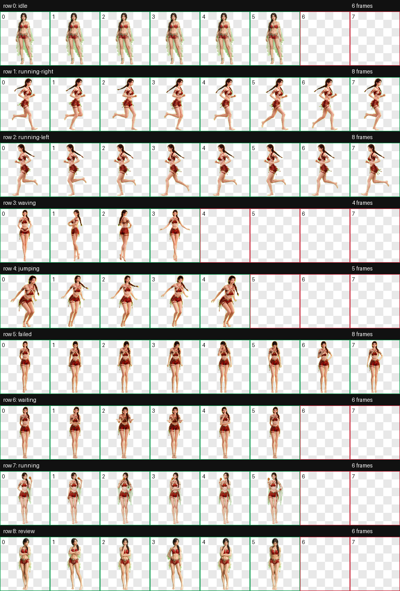

# Yunji Codex Pet

Yunji is a custom animated desktop pet for Codex, adapted from an original
Chinese-fantasy character image.



## Animations

- Idle breathing and blinking
- Running right and left
- A compact ballet spin when the pointer hovers over her
- Jumping
- Failed or blocked reaction
- Waiting for input
- Thinking while eating a roasted chicken drumstick
- Reviewing

Individual animation previews are available in [`previews/`](previews/).

## Install

Copy the packaged pet into your Codex pets directory:

```bash
mkdir -p ~/.codex/pets/yunji
cp pet/pet.json pet/spritesheet.webp ~/.codex/pets/yunji/
```

Restart or reload Codex if the pet does not appear immediately.

## Package

- `pet/pet.json`: pet metadata
- `pet/spritesheet.webp`: `1536x1872` RGBA animation atlas
- `contact-sheet.png`: all animation frames
- `previews/*.gif`: per-state motion previews

The atlas passed geometry, transparency, frame-content, and visual identity
validation before packaging.

## Usage

This repository shares a personal character asset. No license is granted for
commercial reuse, redistribution, model training, or derivative character
merchandise without the owner's permission.
